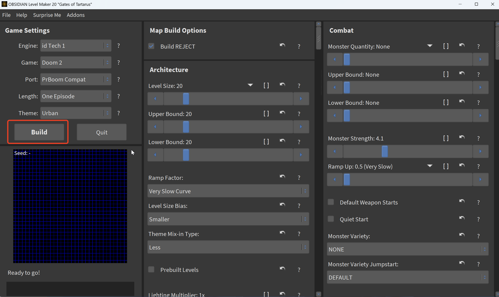

# AiMDoom


This repository contains the AiMDoom dataset and the toolkit used to generate this dataset.

## Dataset

The AiMDoom dataset can be downloaded from [this Google Drive link](https://drive.google.com/drive/folders/1fwhCrxmrJnpdK-egawoX2OYHUxnxAwr-?usp=sharing).

### Dataset Structure

```
AiMDoom_difficulty level
├── Training dataset
│   └── Scene name
│       ├── Scene_name.mtl
│       ├── Scene_name.obj
│       ├── setting.json
│       └── new_texture.png
└── Test dataset
```

## Toolkit

Clone this repository and note that running the following code requires a Python 2.7 environment.

This toolkit is developed based on the code from [devinacker/omgifol](https://github.com/devinacker/omgifol).

The following tools and steps are used to generate the AiMDoom dataset:

### 1. Generate DOOM Maps with OBSIDIAN

First, download [OBSIDIAN](https://obsidian-level-maker.github.io/), an open-source software used to generate DOOM map source files (WAD files).



### 2. Convert WAD Files to Mesh Files

The next step is to convert WAD files to mesh files. This extracts textures and map geometry from a WAD file into an OBJ file, MTL file, and PNG files.

补充：这里假设同级目录里有个步骤1生成的`zone_of_campaign.wad`文件，处理结果放在dataset文件夹中（需要事先`mkdir dataset`）

```
python omgifol/demo/wad2obj.py -s . -o dataset #-s代表扫描当前目录 -o代表将处理结果输出到dataset文件夹中
```

### 3. Reorganize 3D Scene Collections

This script essentially reorganizes 3D scene collections by separating each OBJ file into its own folder with properly structured texture references.

补充：这里原作者笔误，不存在`script.py`文件,已修正；另外，由于原作者建议使用py2.7，需要使用python3以满足新特性；

```
python3 omgifol/demo/wad_files_process.py dataset # 扫描步骤2生成的文件
```

### 4. Clean Up 3D Scenes with Blender

Download Blender version 4.1.1 or higher. The script essentially cleans up 3D scenes by trimming excess geometry and keeping only the main connected part of each scene.

补充：对`blender_process.py`进行修正，避免将不该出现的参数传入到`blender_process.py`中；并对执行路径进行修正

```
blender-4.1.1/blender -b --python omgifol/demo/blender_process.py -- /path/to/your/folder
```

### 5. Texture Baking

Finally, perform texture baking to allow the models to be processed directly by most mainstream 3D libraries like PyTorch3D. This script essentially simplifies 3D models by baking all texture information into a single unified texture, making them more efficient and easier to work with.

补充：原作者文件名打错了，将`warm_texture_images`改成了`warmp_texture_images`,进行文件内容修正，避免将不该出现的参数传入到`warmp_texture_images.py`中；修正了执行路径；添加了报错日志，终端里啥错误也不输出，不然根本不知道哪里出错了；

```
blender-4.1.1/blender -b --python omgifol/demo/warmp_texture_images.py -- dataset > /tmp/warm_texture.log 2>&1
tail -n 200 /tmp/warm_texture.log #查看报错日志
```

## License
This dataset is released under the [MIT License](LICENSE).

If you use this dataset or our code, please cite the following paper:

```
@article{li2025nextbestpath,
  title={NextBestPath: Efficient 3D Mapping of Unseen Environments},
  author={Li, Shiyao and Gu{\'e}don, Antoine and Boittiaux, Cl{\'e}mentin and Chen, Shizhe and Lepetit, Vincent},
  journal={arXiv preprint arXiv:2502.05378},
  year={2025}
}
```
